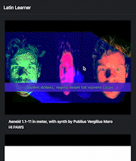

[![Contributors][contributors-shield]][contributors-url]
[![Forks][forks-shield]][forks-url]
[![Stargazers][stars-shield]][stars-url]
[![Issues][issues-shield]][issues-url]
[![MIT License][license-shield]][license-url]
[![LinkedIn][linkedin-shield]][linkedin-url]

<br />

<p align="center">
  <h3 align="center">Latin Learner - Karaoke</h3>

  <p align="center">
    A website that allows you to listen to latin language music, with the lyrics available ahead of time. So you can sing along with the videos. Lyrics are also included in english.
    <br />
    <a href="https://benjenkinsv95.github.io/latin-learner/">View Demo</a>
    ·
    <a href="https://github.com/benjenkinsv95/latin-learner/issues">Report Bug</a>
    ·
    <a href="https://github.com/benjenkinsv95/latin-learner/issues">Request Feature</a>
  </p>
</p>



<!-- TABLE OF CONTENTS -->

## Table of Contents

- [Table of Contents](#table-of-contents)
- [About The Project](#about-the-project)
  - [Built With](#built-with)
- [Getting Started](#getting-started)
  - [Installation](#installation)
- [Roadmap](#roadmap)
- [Contributing](#contributing)
- [License](#license)
- [Contact](#contact)

<!-- ABOUT THE PROJECT -->

## About The Project

### Built With

- React
- React Router
- Express
- Bootstrap

## Getting Started

To get a local copy up and running follow these simple steps.

### Installation

1. Clone the repo

```sh
git clone https:://github.com/benjenkinsv95/latin-learner.git
```

2. Install NPM packages

```sh
npm install
```

3. Start Website

```sh
npm run start
```

## Roadmap

See the [open issues](https://github.com/benjenkinsv95/latin-learner/issues) for a list of proposed features (and known issues).

<!-- CONTRIBUTING -->

## Contributing

Contributions are what make the open source community such an amazing place to be learn, inspire, and create. Any contributions you make are **greatly appreciated**.

1. Fork the Project
2. Create your Feature Branch (`git checkout -b feature/AmazingFeature`)
3. Commit your Changes (`git commit -m 'Add some AmazingFeature'`)
4. Push to the Branch (`git push origin feature/AmazingFeature`)
5. Open a Pull Request

<!-- LICENSE -->

## License

Distributed under the MIT License. See `LICENSE` for more information.

<!-- CONTACT -->

## Contact

Your Name - [@benjenkinsv95](https://twitter.com/benjenkinsv95) - benjenkinsv95@gmail.com

Project Link: [https://github.com/benjenkinsv95/latin-learner](https://github.com/benjenkinsv95/latin-learner)

<!-- MARKDOWN LINKS & IMAGES -->
<!-- https://www.markdownguide.org/basic-syntax/#reference-style-links -->

[contributors-shield]: https://img.shields.io/github/contributors/benjenkinsv95/latin-learner.svg?style=flat-square
[contributors-url]: https://github.com/benjenkinsv95/latin-learner/graphs/contributors
[forks-shield]: https://img.shields.io/github/forks/benjenkinsv95/latin-learner.svg?style=flat-square
[forks-url]: https://github.com/benjenkinsv95/latin-learner/network/members
[stars-shield]: https://img.shields.io/github/stars/benjenkinsv95/latin-learner.svg?style=flat-square
[stars-url]: https://github.com/benjenkinsv95/latin-learner/stargazers
[issues-shield]: https://img.shields.io/github/issues/benjenkinsv95/latin-learner.svg?style=flat-square
[issues-url]: https://github.com/benjenkinsv95/latin-learner/issues
[license-shield]: https://img.shields.io/github/license/benjenkinsv95/latin-learner.svg?style=flat-square
[license-url]: https://github.com/benjenkinsv95/latin-learner/blob/master/LICENSE.txt
[linkedin-shield]: https://img.shields.io/badge/-LinkedIn-black.svg?style=flat-square&logo=linkedin&colorB=555
[linkedin-url]: https://linkedin.com/in/benjenkinsv95
